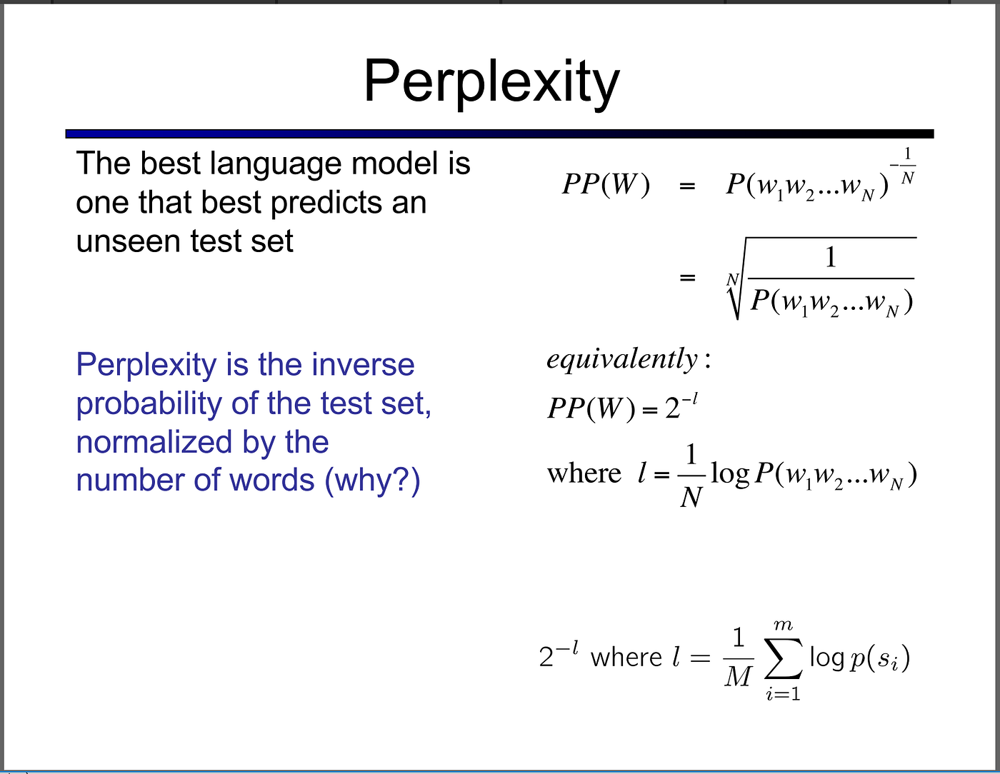
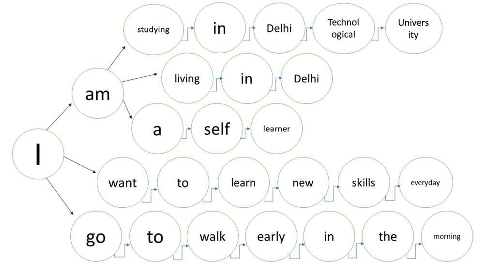

## 5. Mathematical Intuition for Language Processing

For many students, mathematics is the most intimidating aspect of Computational Linguistics. This difficulty often arises not from the ideas themselves, but from how they are presented. In practice, mathematics in language processing serves to formalize intuitions that linguists already use informally.

This chapter introduces core mathematical ideas with an emphasis on interpretation and intuition rather than formal derivation.

---

### 5.1 Why Mathematics Appears in Language Processing

Language is uncertain, variable, and large-scale. Computational systems must reason about preference, expectation, and likelihood. Mathematics provides a precise framework for expressing these intuitions.

**Figure 5.1: Linguistic Intuition and Mathematical Formalization**

This figure shows how intuitive linguistic notions such as frequency and similarity correspond to mathematical representations such as counts and vectors.

---

### 5.2 Counting and Frequencies

Many computational approaches begin with simple counting. Frequency information allows systems to prioritize common patterns while still allowing rare forms to exist.

**Figure 5.2: Word Frequency Distribution in a Corpus**

This figure illustrates that a small number of words occur very frequently, while most words occur rarely.

---

### 5.3 Probability as Uncertainty

Probability provides a way to model uncertainty in language. Instead of committing to a single interpretation, probabilistic models maintain multiple ranked possibilities.

**Figure 5.3: Probabilistic Expectations for Next-Word Prediction**

The figure demonstrates how models assign different likelihoods to possible continuations.

---

### 5.4 Conditional Probability and Context

Conditional probability captures how context influences expectations. Linguistic predictions depend strongly on surrounding words.

**Figure 5.4: Contextual Influence in Conditional Probability**

This figure shows how probability mass shifts depending on contextual cues.

---

### 5.5 Why Zero Is a Problem

Language data is sparse. Treating unseen events as impossible causes models to fail on new input.

**Figure 5.5: The Zero-Probability Problem**

The figure contrasts failure under zero probability with successful generalization using smoothing.

---

### 5.6 Log Probabilities Explained Simply

Probabilities for long sequences become extremely small. Log probabilities transform multiplication into addition, improving numerical stability.

**Figure 5.6: Probability Multiplication vs. Log Probability Addition**

This transformation is computationally motivated and does not change the underlying interpretation.

---

### 5.7 Vectors as Linguistic Representations

Modern models represent linguistic units as vectors encoding contextual information.

**Figure 5.7: Word Vectors as Feature Containers**

Vectors allow systems to capture graded similarity rather than rigid categories.

**Figure 5.7.1: Similarity and Distance in Vector Space**

Distance between vectors reflects similarity in meaning or usage.

5.4 Perplexity: Measuring Prediction Quality

Perplexity is a standard evaluation measure for language models. Instead of asking whether a model produces a correct or incorrect sentence, perplexity measures how surprised the model is by real, unseen language data. A good model assigns higher probability to natural language and therefore exhibits lower perplexity.

Figure 5.1: Perplexity as a Measure of Language Model Quality.
This figure illustrates perplexity as the inverse probability of a test sequence, normalized by sentence length. Lower perplexity indicates that the model predicts language more confidently and consistently. The normalization allows fair comparison across sentences of different lengths.

5.5 Language as a Probabilistic Decision Process

Language generation can be understood as a sequence of probabilistic choices. At each word position, multiple continuations are possible, each with a different likelihood. Rather than committing to a single path, a language model maintains a distribution over possible next words.

Figure 5.2: Language as a Probabilistic Decision Tree.
This figure represents sentence construction as a branching process. From a given word, several continuations are available, reflecting conditional probabilities rather than fixed grammatical rules. More probable paths correspond to more fluent or expected language use.

5.6 Uncertainty and Interpretation in Language Processing

Language understanding involves managing uncertainty. Multiple interpretations often compete before a final decision is reached. Computational models must balance evidence from context, frequency, and structure before resolving ambiguity.

Figure 5.3: Cognitive Uncertainty in Language Processing.
The illustration metaphorically captures competing interpretations and decision signals. It emphasizes why probabilistic reasoning is essential: both human cognition and computational systems must handle ambiguity rather than eliminate it prematurely.

5.7 Language Diversity and Scale

Computational models of language operate at a global scale. Languages are not evenly distributed across populations; a small number of languages dominate available data, while many others are low-resource. This imbalance strongly influences model design and evaluation.

Figure 5.4: Global Distribution of Languages.
This figure situates language processing in a worldwide context, showing the uneven distribution of languages. It motivates the use of mathematical tools—such as probability smoothing and vector representations—to generalize beyond limited data and support linguistic diversity.
---

### Chapter Summary

This chapter developed the mathematical intuition underlying modern approaches to language processing, emphasizing interpretation over formal derivation. Rather than treating mathematics as an abstract or intimidating component, the chapter showed how mathematical concepts arise naturally from linguistic reasoning about frequency, uncertainty, similarity, and scale.

Beginning with counting and frequency distributions, the chapter demonstrated how simple quantitative observations form the foundation of probabilistic language models. Probability was introduced as a way to manage uncertainty, allowing models to represent multiple plausible interpretations rather than committing to a single outcome. Conditional probability illustrated how linguistic context reshapes expectations, while smoothing techniques addressed the unavoidable sparsity of real language data.

The chapter further explained why log probabilities are used in practice, highlighting their computational role in maintaining numerical stability without altering linguistic interpretation. Vector representations were then introduced as a powerful way to encode linguistic units, enabling models to capture graded similarity and semantic relationships geometrically. Interactive visualizations reinforced the intuition that meaning emerges from patterns of usage rather than predefined categories.

Finally, evaluation through perplexity and consideration of global language diversity connected mathematical modeling to real-world language use. Together, these topics showed that mathematics in Computational Linguistics serves as a unifying framework for expressing linguistic intuition precisely, scaling it to large datasets, and enabling robust generalization. By grounding formal concepts in visual and conceptual explanations, the chapter prepares readers to engage confidently with computational models in subsequent chapters.
